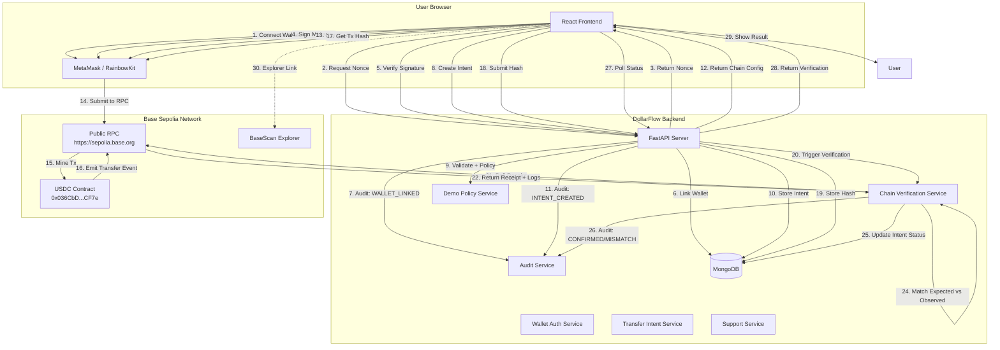

# DollarFlow V1 — Architecture

## System Diagram



## Non-Custodial Transaction Flow

### 1. Wallet Ownership Verification (SIWE-style)

```
User connects wallet
    │
    ▼
Frontend requests nonce from backend
    │ (user_id, wallet_address, domain, chain_id, issued_at, expires_at)
    ▼
Backend generates cryptographically secure nonce (32 bytes)
    │
    ▼
Frontend builds message:
"DollarFlow Wallet Verification
Domain: localhost:3000
Address: 0x...
Chain ID: 84532
Nonce: 0x...
Issued At: 1234567890
Expires At: 1234568190
Statement: Signing this message proves ownership... NOT a blockchain transaction
Terms Version: v1.0"
    │
    ▼
User signs message in wallet (eth_sign / personal_sign)
    │
    ▼
Frontend sends signature + message to backend
    │
    ▼
Backend verifies:
- Nonce exists, active, not expired, belongs to user
- Message matches expected template exactly
- Recovered signer == requested wallet_address
    │
    ▼
Backend invalidates nonce (single-use)
Creates/updates wallet_links record
Emits WALLET_LINKED audit event
```

### 2. Transaction Intent Lifecycle

```
PENDING_SIGNATURE
    │ (user creates intent via API)
    ▼
SUBMITTED
    │ (user signs transfer in wallet, submits tx hash)
    ▼
CONFIRMING
    │ (backend polls receipt, parses Transfer event)
    ▼
CONFIRMED ──► Exact match: sender, recipient, amount, contract, chain
    │
    ├──► FAILED ──► Receipt status = 0 (reverted) or timeout
    │
    └──► EXCEPTION_MISMATCH ──► Receipt success but Transfer event mismatch:
         ├── WRONG_CHAIN
         ├── WRONG_TOKEN
         ├── WRONG_SENDER
         ├── WRONG_RECIPIENT
         ├── WRONG_AMOUNT
         └── MISSING_TRANSFER_EVENT
```

### 3. Independent Chain Verification

Backend **never trusts frontend-reported success**. Verification process:

```python
async def verify_transaction(intent_id, tx_hash):
    # 1. Fetch receipt from Base Sepolia RPC
    receipt = await rpc.get_transaction_receipt(tx_hash)
    
    if receipt is None:
        return "CONFIRMING"  # Not yet mined, will retry
    
    if receipt.status == 0:
        return "FAILED"  # Transaction reverted
    
    # 2. Parse Transfer events from receipt logs
    events = parse_transfer_events(receipt)
    
    # 3. Find matching Transfer event
    expected = {
        "from": intent.sender_wallet,
        "to": intent.recipient_wallet,
        "value": intent.amount_atomic,
        "contract": USDC_CONTRACT_ADDRESS,
    }
    
    match = find_matching_transfer(events, expected)
    
    if match:
        return "CONFIRMED"
    else:
        return "EXCEPTION_MISMATCH"  # with detailed mismatch reasons
```

## Intent → Submission → Verification Lifecycle

| Stage | Frontend Action | Backend Action | DB State |
|-------|----------------|----------------|----------|
| 1. Create | POST `/transaction-intents` | Validate, check policy, store intent | `PENDING_SIGNATURE` |
| 2. Sign | Wallet signs `transfer()` | — | `PENDING_SIGNATURE` |
| 3. Submit | POST `/transaction-intents/{id}/submit` | Store hash, trigger verification | `SUBMITTED` |
| 4. Verify | Poll GET `/transaction-intents/{id}` | Poll RPC, parse events, match | `CONFIRMING` |
| 5. Result | Display status | Update intent + verification | `CONFIRMED` / `FAILED` / `EXCEPTION_MISMATCH` |

## Persistence Collections (MongoDB)

### `wallet_auth_nonces`
```javascript
{
  nonce: "0x...",           // unique, 32 bytes hex
  user_id: "user_...",
  wallet_address: "0x...",
  domain: "localhost:3000",
  chain_id: 84532,
  issued_at: 1234567890,
  expires_at: 1234568190,   // TTL index
  used_at: null,
  attempt_count: 0,
  status: "active"          // active | used | expired | invalidated
}
```
Indexes: `nonce` (unique), `(user_id, wallet_address, status)`, TTL on `expires_at`

### `wallet_links`
```javascript
{
  user_id: "user_...",
  wallet_address: "0x...",  // checksum normalized
  chain_id: 84532,
  label: null,
  status: "active",         // active | unlinked
  verified_at: 1234567890,
  last_seen_at: 1234567890,
  created_at: 1234567890,
  updated_at: 1234567890
}
```
Indexes: `(user_id, wallet_address)` unique, `wallet_address`, `user_id`

### `transaction_intents`
```javascript
{
  id: "intent_...",
  user_id: "user_...",
  client_request_id: "req_...",  // unique per user
  sender_wallet: "0x...",
  recipient_wallet: "0x...",
  amount_atomic: "25500000",     // string-safe integer
  amount_display: "25.50",
  token_symbol: "USDC",
  token_contract: "0x036CbD...",
  token_decimals: 6,
  chain_id: 84532,
  status: "PENDING_SIGNATURE",   // PENDING_SIGNATURE | SUBMITTED | CONFIRMING | CONFIRMED | FAILED | EXCEPTION_MISMATCH | EXPIRED | CANCELLED_BEFORE_SUBMISSION
  risk_disclosure_version: "v1.0",
  risk_disclosure_accepted_at: 1234567890,
  policy_result: { assessment_status: "clear", ... },
  created_at: 1234567890,
  submitted_at: 1234567900,
  confirmed_at: 1234567950,
  expires_at: 1234568790,
  transaction_hash: "0x...",
  failure_code: null,
  failure_reason: null,
  metadata: { purpose: "Test transfer" }
}
```
Indexes: `(user_id, created_at)`, `transaction_hash` (unique sparse), `(user_id, client_request_id)` unique, `(status, created_at)`

### `chain_verifications`
```javascript
{
  id: "verify_intent_...",
  intent_id: "intent_...",
  transaction_hash: "0x...",
  verification_status: "matched",  // pending | matched | mismatch | failed | not_found
  observed_chain_id: 84532,
  observed_block_number: 1234567,
  observed_from: "0x...",
  observed_to: "0x...",
  observed_amount_atomic: "25500000",
  observed_token_contract: "0x036CbD...",
  receipt_status: 1,
  confirmations_observed: 3,
  raw_receipt_redacted: { ... },
  mismatch_reasons: [],
  verified_at: 1234567950,
  created_at: 1234567900
}
```

### `audit_events` (append-only, hash-chained)
```javascript
{
  id: "audit_abc123...",
  actor_user_id: "user_...",
  event_type: "TRANSFER_INTENT_CREATED",
  resource_type: "transaction_intent",
  resource_id: "intent_...",
  event_payload_json: { ... },
  previous_event_hash: "0x...",  // SHA256(prev + canonical_json(payload))
  event_hash: "0x...",
  ip_hash: "sha256(ip+salt)",
  user_agent_hash: "sha256(ua+salt)",
  created_at: 1234567890
}
```
**Hash chain**: `event_hash = SHA256(previous_event_hash + canonical_json(payload))`
**Canonical JSON**: `json.dumps(payload, separators=(',', ':'), sort_keys=True, ensure_ascii=True)`

### `support_cases`
```javascript
{
  id: "case_...",
  user_id: "user_...",
  transaction_intent_id: "intent_...",
  type: "support",  // support | complaint | suspicious_activity_report
  category: "transfer_pending",
  description: "User description...",
  status: "open",  // open | in_review | resolved | closed
  priority: "normal",
  assigned_to: null,
  resolution_note: null,
  created_at: 1234567890,
  updated_at: 1234567890,
  resolved_at: null
}
```

### `compliance_demo_assessments`
```javascript
{
  id: "compliance_...",
  intent_id: "intent_...",
  assessment_status: "clear",  // clear | review | blocked
  rules_evaluated: ["address_format", "demo_transfer_cap", ...],
  findings: { ... },
  disclaimer_version: "v1.0-demo",
  created_at: 1234567890
}
```

## Why Backend Verifies Independently

1. **Frontend can be compromised** — User could modify JS to fake success
2. **Wallet can report success incorrectly** — RPC errors, race conditions
3. **Only on-chain truth matters** — Receipt + Transfer event are source of truth
4. **Mismatch detection** — Catches wrong recipient, amount, token, chain
5. **Audit requirement** — Independent verification creates tamper-evident record

## Trust Boundaries

```
┌─────────────────────────────────────────────────────────────────┐
│                        USER'S BROWSER                            │
│  ┌─────────────┐  ┌─────────────┐  ┌─────────────────────────┐  │
│  │  React UI   │  │  Wallet     │  │  Private Keys           │  │
│  │  (React)    │  │  (MetaMask) │  │  (NEVER leave browser)  │  │
│  └─────────────┘  └─────────────┘  └─────────────────────────┘  │
└─────────────────────────────────────────────────────────────────┘
                              │
                              │ HTTPS (tx hash, intent data)
                              ▼
┌─────────────────────────────────────────────────────────────────┐
│                      DOLLARFLOW BACKEND                          │
│  ┌─────────────┐  ┌─────────────┐  ┌─────────────────────────┐  │
│  │  FastAPI    │  │  MongoDB    │  │  Private Keys           │  │
│  │  (API)      │  │  (Data)     │  │  (NEVER stored)         │  │
│  └─────────────┘  └─────────────┘  └─────────────────────────┘  │
└─────────────────────────────────────────────────────────────────┘
                              │
                              │ RPC (read-only)
                              ▼
┌─────────────────────────────────────────────────────────────────┐
│                      BASE SEPOLIA                                │
│  ┌─────────────┐  ┌─────────────┐  ┌─────────────────────────┐  │
│  │  Public RPC │  │  USDC       │  │  User's EOA             │  │
│  │  (read)     │  │  Contract   │  │  (signs transfer)       │  │
│  └─────────────┘  └─────────────┘  └─────────────────────────┘  │
└─────────────────────────────────────────────────────────────────┘
```

**Key Invariant**: Private keys exist **only** in user's browser wallet. Backend never sees, stores, derives, or logs them.